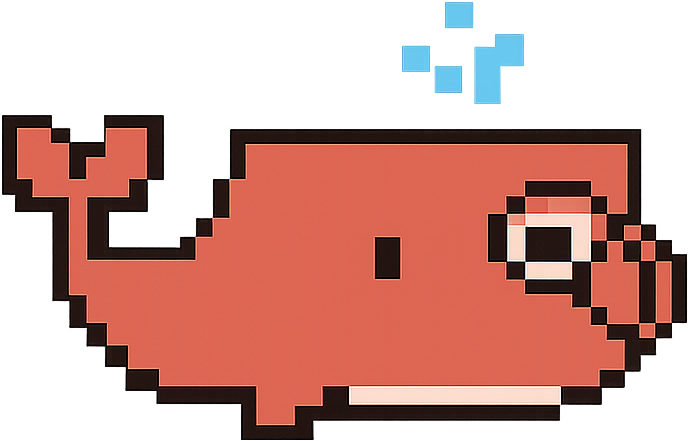

<p align="center">
  
</p>

<h1 align="center">Claudeck</h1>

<p align="center">
  A browser-based UI for <a href="https://docs.anthropic.com/en/docs/claude-code">Claude Code</a> — chat, workflows, agents, cost tracking, and more.
</p>

<p align="center">
  <a href="https://www.producthunt.com/products/claudeck?embed=true&utm_source=badge-featured&utm_medium=badge&utm_campaign=badge-claudeck" target="_blank" rel="noopener noreferrer"></a>
</p>

<p align="center">
  <a href="https://www.npmjs.com/package/claudeck"></a>
  <a href="https://github.com/hamedafarag/claudeck/blob/main/LICENSE"></a>
  
  
  
</p>

---

## Quick Start

```bash
# One-command launch (no install needed)
npx claudeck

# Custom port
npx claudeck --port 3000

# Enable authentication (for remote access via Cloudflare Tunnel, etc.)
npx claudeck --auth

# Or install globally
npm install -g claudeck
claudeck
```

On first run, Claudeck will ask you to choose a port (default: `9009`), then open your browser to the URL shown in the terminal. The port is saved to `~/.claudeck/.env` for future runs.

> Requires **Node.js 18+** and Claude Code CLI authentication (`claude auth login`).

User data lives in `~/.claudeck/` (config, database, plugins) — safe for NPX upgrades.

---

## Why Claudeck?

- **Zero-framework** — Vanilla JS + Web Components, 6 npm dependencies, no build step
- **Full agent orchestration** — Chains, DAGs, orchestrator, and monitoring dashboard
- **Persistent memory** — Cross-session project knowledge with FTS5 search and AI optimization
- **Cost visibility** — Per-session tracking, daily charts, token breakdowns
- **Secure remote access** — Token-based auth for Cloudflare Tunnel or reverse proxy setups
- **Works everywhere** — PWA, mobile responsive, Telegram AFK approval
- **Extensible** — Full-stack plugin system with auto-discovery

---

## Features

### Chat & Sessions

- Real-time WebSocket streaming with session persistence
- **Parallel mode** — 2x2 grid of 4 independent conversations
- Background sessions that keep running when you switch away
- Session search, pinning, auto-generated titles
- **Session branching** — fork any conversation at an assistant message to explore alternatives
- **Message recall** — press `↑` on empty input to cycle through previous messages, or click the history button to browse and re-use
- Voice input via Web Speech API (Chrome/Safari)

### Autonomous Agents

- 4 built-in agents: PR Reviewer, Bug Hunter, Test Writer, Refactoring
- **Agent Chains** — Sequential pipelines with context passing
- **Agent DAGs** — Visual dependency graph editor with parallel execution
- **Orchestrator** — Describe a task, it auto-delegates to specialist agents
- **Agent Monitor** — Metrics, cost aggregation, success rates, leaderboard

### Workflows

- Multi-step workflows with full CRUD
- 4 pre-built: Review PR, Onboard Repo, Migration Plan, Code Health
- Each step carries context forward

### Code & Files

- **File Explorer** — Lazy tree, syntax-highlighted preview, drag-to-chat
- **File Picker** — Attach files with type dots, binary detection, search, selected chips
- **Git Panel** — Branch switching, staging, commit, log, inline diff viewer
- **Git Worktrees** — Run any chat/agent task in an isolated worktree; merge, diff, or discard results
- **Repos Manager** — Organize repos in nested groups with GitHub links
- Code diff viewer with LCS-based line highlighting

### Cost & Analytics

- Per-session cost tracking with daily timeline charts
- Input/output token breakdown, streaming token counter
- Error pattern analysis (9 categories), tool usage stats

### Persistent Memory

- Cross-session project knowledge that survives restarts
- Auto-capture from assistant responses using pattern-based heuristic extraction
- `/remember` command for manual memory creation
- FTS5 full-text search with relevance scoring and time-decay
- AI-powered optimization (consolidation via Claude Haiku)
- Memory panel in right sidebar with search, filtering, and inline editing

### Notifications

- **Notification Bell** — Persistent notification history with unread badge in the header
- Background session events (completed, errored, input needed) logged automatically
- Agent completion/error notifications with cost and duration metrics
- Full history modal with type/status filters, bulk actions, and pagination
- 4 read strategies: explicit click, mark all, auto-read on view, click-through to session
- Real-time cross-tab sync via WebSocket broadcasts

### Skills Marketplace

- **SkillsMP Integration** — Browse and install agent skills from the [SkillsMP](https://skillsmp.com/) registry
- Keyword search and AI semantic search with mode toggle
- Install skills globally (`~/.claude/skills/`) or per-project (`.claude/skills/`)
- Enable/disable skills via toggle (renames `SKILL.md` ↔ `SKILL.md.disabled`)
- Installed skills auto-register as `/` slash commands
- "Skill used" system messages in chat for both user-invoked and model-invoked skills
- Token-gated — enter your free SkillsMP API key to activate

### Integrations

- **MCP Manager** — Add/edit/remove MCP servers (global + per-project)
- **Linear** — View and create issues from the sidebar
- **Telegram** — Rich notifications + AFK approve/deny via inline keyboard
- **Push Notifications** — Web-push with audio chime, works when browser is closed

### Prompt & Command System

- 16 built-in prompt templates with `{{variable}}` placeholders
- Auto-discovers `.claude/commands/` and `.claude/skills/` from your project
- 40+ slash commands for every feature

### Permissions

| Mode | Behavior |
|------|----------|
| **Bypass** | Auto-approve everything |
| **Confirm Writes** | Auto-approve reads, prompt for writes |
| **Confirm All** | Prompt for every tool call |
| **Plan Mode** | No execution, planning only |

### Security & UI

- **Authentication** — `--auth` flag enables token-based auth with login page, HttpOnly cookies, and WebSocket verification. Localhost bypasses auth by default (auto-detected proxy headers like `X-Forwarded-For` disable the bypass for tunneled requests).
- Dark theme (terminal CRT aesthetic) and light theme
- Installable as a PWA with offline fallback
- Mobile responsive with tablet/mobile breakpoints
- Welcome screen with Whaly mascot and 18-step guided tour
- Full-stack plugin system with marketplace UI

---

## Architecture

```
browser ──── WebSocket ──── server.js ──── Claude Code SDK
                               |
                          server/routes/         ~/.claudeck/
                          server/agent-loop.js     ├── config/     (JSON configs)
                          server/orchestrator.js   ├── plugins/    (user plugins)
                          server/dag-executor.js   ├── data.db     (SQLite + memories)
                          server/notification-logger.js
                          server/utils/git-worktree.js
                          server/auth.js
                          server/memory-optimizer.js └── .env      (VAPID keys, auth token)
                          plugins/
```

| Layer | Technology |
|-------|------------|
| Runtime | Node.js 18+ (ESM) |
| Backend | Express 4, WebSocket (ws 8), web-push 3 |
| AI SDK | @anthropic-ai/claude-code |
| Database | SQLite via better-sqlite3 (WAL mode) |
| Frontend | Vanilla JS ES modules + Web Components (Light DOM), CSS custom properties |
| Testing | Vitest + happy-dom (2,400+ tests, 55% coverage) |
| Rendering | highlight.js, Mermaid (diagrams) — CDN |

---

## Slash Commands

```
/clear /new /parallel /export /theme /shortcuts       App
/costs /analytics                                      Dashboards
/files /git /repos /events /mcp /tips /skills           Panels
/remember                                              Memory
/review-pr /onboard-repo /migration-plan /code-health  Workflows
/agent-pr-reviewer /agent-bug-hunter /agent-test-writer Agents
/orchestrate /monitor /chain-* /dag-*                   Multi-Agent
/code-review /find-bugs /write-tests /refactor ...     Prompts (16)
/run <cmd>                                             Shell
```

---

## Keyboard Shortcuts

| Shortcut | Action |
|----------|--------|
| `Cmd+K` | Session search |
| `Cmd+N` | New session |
| `Cmd+B` | Toggle right panel |
| `Cmd+/` | Show all shortcuts |
| `Cmd+Shift+E/G/R/V/T` | Files / Git / Repos / Events / Tips  |
| `Cmd+1`-`4` | Focus parallel pane |
| `↑` / `↓` | Recall previous/next message (empty input) |

---

## Configuration

All user data lives in `~/.claudeck/` (override with `CLAUDECK_HOME`):

```
~/.claudeck/
├── config/
│   ├── folders.json          Projects
│   ├── prompts.json          Prompt templates
│   ├── workflows.json        Workflows
│   ├── agents.json           Agent definitions
│   ├── agent-chains.json     Sequential pipelines
│   ├── agent-dags.json       Dependency graphs
│   ├── repos.json            Repository groups
│   ├── bot-prompt.json       Assistant bot prompt
│   ├── telegram-config.json  Telegram config
│   └── skillsmp-config.json  Skills Marketplace config
├── plugins/                  User-installed plugins
├── data.db                   SQLite database
└── .env                      VAPID keys, port, auth token
```

Defaults are copied on first run. User edits are never overwritten on upgrade.

See [CONFIGURATION.md](docs/CONFIGURATION.md) for the full guide.

---

## Plugins

Claudeck includes 7 built-in plugins and supports user plugins via `~/.claudeck/plugins/`:

| Plugin | Description |
|--------|-------------|
| **Tasks** | Todo list with priority, archive, and brag tracking |
| **Linear** | Linear issue tracking with team management |
| **Repos** | Repository management with tree view |
| **Claude Editor** | Edit CLAUDE.md project instructions in-app |
| **Event Stream** | Real-time WebSocket event viewer |
| **Games** | Tic-tac-toe and Sudoku |

**Create your own** — drop files in `~/.claudeck/plugins/<name>/` (persists across upgrades) with `client.js` and optionally `server.js`, `client.css`, `config.json`. No fork needed. See [CONFIGURATION.md](docs/CONFIGURATION.md#user-plugins) for details.

**Scaffold with Claude Code** — install the plugin creator skill and let Claude build plugins for you:

```bash
npx skills add https://github.com/hamedafarag/claudeck-skills
# Then in Claude Code:
/claudeck-plugin-create my-widget A dashboard showing system metrics
```

---

## Documentation

| Document | Description |
|----------|-------------|
| [DOCUMENTATION.md](docs/DOCUMENTATION.md) | Full feature docs, API reference, database schema |
| [CONFIGURATION.md](docs/CONFIGURATION.md) | User data directory, config files, plugin system |
| [AGENT-ARCHITECTURE.md](docs/AGENT-ARCHITECTURE.md) | How agents, chains, DAGs, and orchestrator work |
| [CROSS-PLATFORM-AUDIT.md](docs/CROSS-PLATFORM-AUDIT.md) | Windows/Linux compatibility |
| [COMPETITIVE-ANALYSIS.md](docs/COMPETITIVE-ANALYSIS.md) | Feature comparison with similar tools |

---

## Testing

```bash
npm test              # Run all 2,400+ tests
npm test -- --coverage  # With coverage report
```

| Layer | Tests | Coverage |
|-------|-------|----------|
| **components/** (Web Components) | 170+ | 100% |
| **core/** | 110+ | 90% |
| **ui/** | 280+ | 65% |
| **features/** | 210+ | 22% |
| **panels/** | 150+ | 35% |
| **server/** | 1,350+ | 95% |

19 Web Components in `public/js/components/` — each is a self-contained Custom Element (Light DOM) that owns its HTML, testable with zero mocks.

---

## Contributing

Contributions are welcome! Fork the repo, make your changes, and open a PR.

```bash
git clone https://github.com/hamedafarag/claudeck.git
cd claudeck
npm install
npm start
npm test    # Run tests before submitting
```

See [DOCUMENTATION.md](docs/DOCUMENTATION.md) for architecture details and [CONFIGURATION.md](docs/CONFIGURATION.md) for the config system.

---

## License

[MIT](LICENSE)

---

<p align="center">
  <sub>Built with Whaly by <a href="https://github.com/hamedafarag">Hamed Farag</a></sub>
</p>
