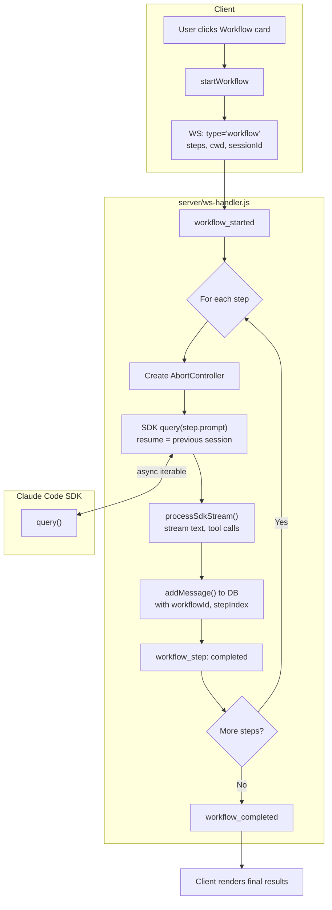
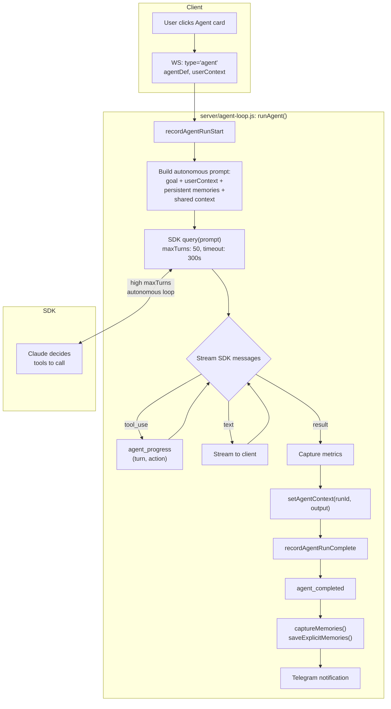
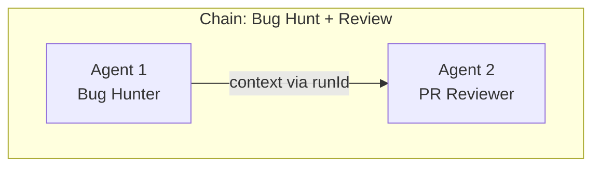
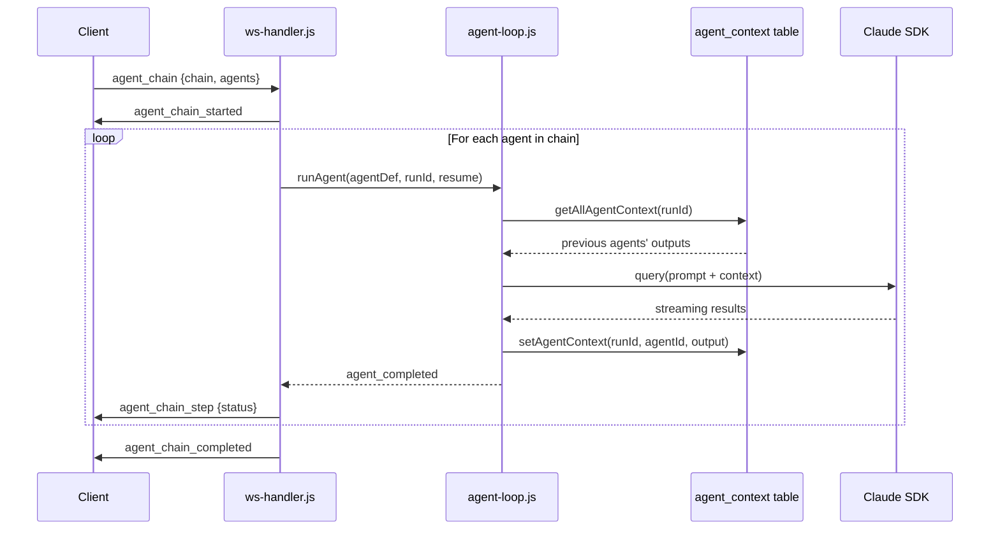
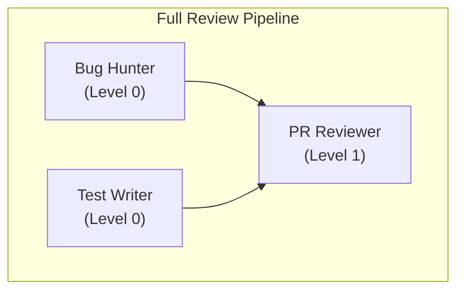
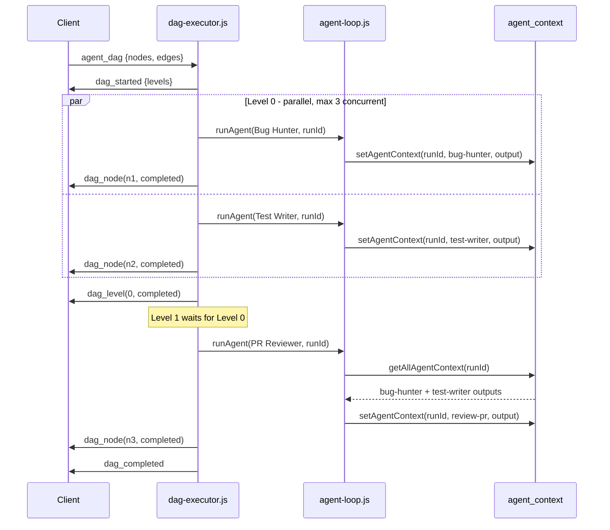
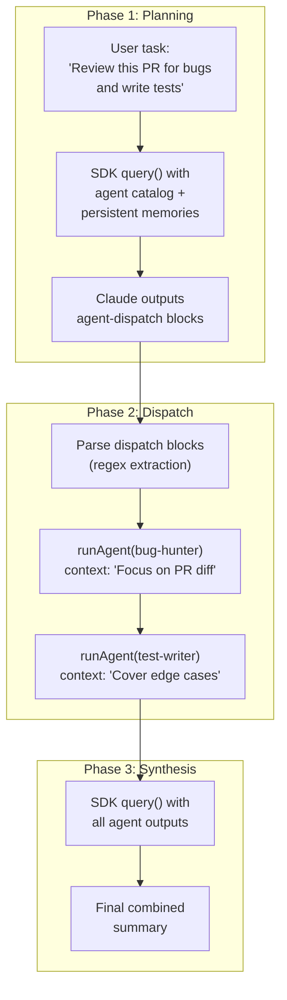
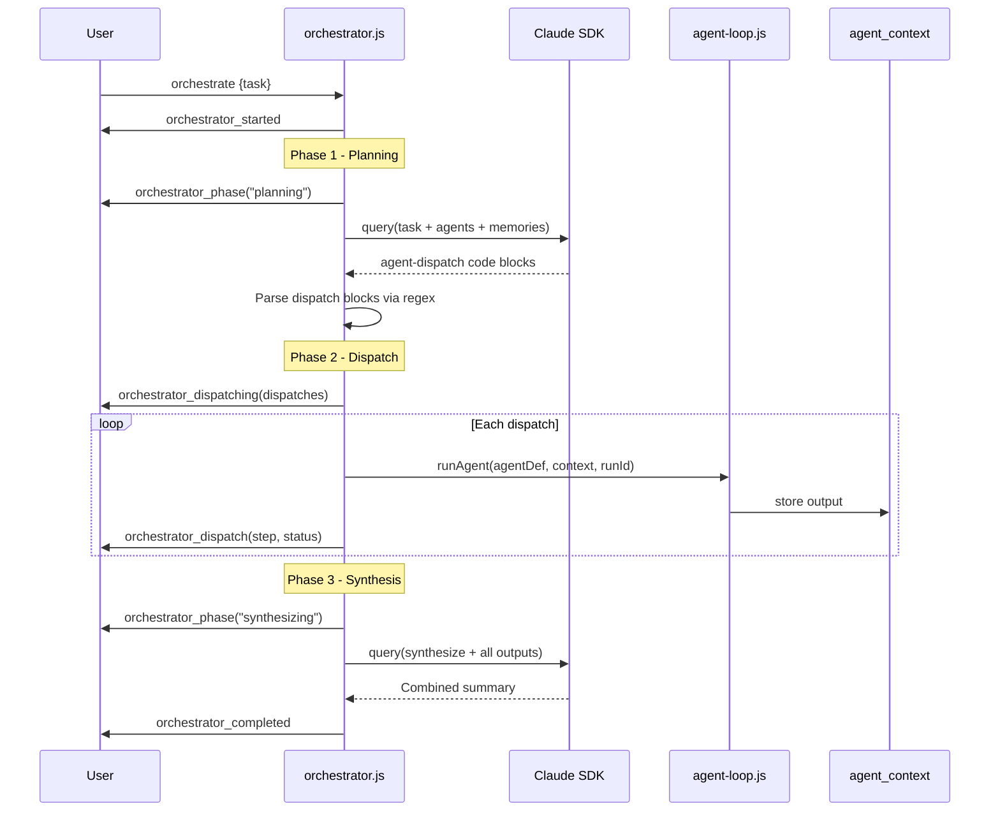

# Claudeck Agent Architecture

How Agents, Chains, DAGs, Workflows, and the Orchestrator work internally.

---

## 1. Workflows — Sequential Multi-Step Execution

**Key files:** `server/ws-handler.js:375-472`, `public/js/features/workflows.js`, `config/workflows.json`



### How it works

1. Client sends a `workflow` WebSocket message with the workflow definition (steps array)
2. Server iterates through steps **sequentially**
3. Each step calls `query()` from the Claude SDK with the step's prompt
4. Steps are chained via the SDK `resume` option — each step resumes the previous Claude session, so context accumulates naturally
5. Messages are saved to DB with workflow metadata (`workflowId`, `stepIndex`, `stepLabel`)
6. No explicit context extraction needed — the SDK session carries conversation history forward
7. On completion, Telegram notification sent with step summary

### WebSocket messages

| Message | When |
|---------|------|
| `workflow_started` | Chain begins |
| `workflow_step` | Per step (status: running/completed/aborted) |
| `workflow_completed` | All steps done |
| `done` | Cleanup signal |

---

## 2. Autonomous Agents — Single Long-Running Execution

**Key files:** `server/agent-loop.js:81-413`, `public/js/features/agents.js`, `config/agents.json`



### How it works

1. Server builds an autonomous prompt: agent goal + optional `userContext` + **persistent memories** from prior sessions (via `buildAgentMemoryPrompt()`) + shared context from prior agents (if part of a chain/DAG)
2. Runs a **single long `query()`** with high `maxTurns` (default 50, timeout 300s)
3. Claude autonomously decides which tools to use and when to stop
4. Each tool usage broadcasts an `agent_progress` message with turn count and action
5. On completion, the agent's final output is stored in `agent_context` table for downstream agents
6. **Memory capture** — agent output is processed for auto-extraction (`captureMemories()`) and explicit `\`\`\`memory` blocks (`saveExplicitMemories()`)
7. **Telegram notification** — rich notification with goal snippet, output snippet, and metrics (cost, tokens, duration, turns)

### Key difference from workflows

Workflows chain **multiple short queries** (one per step). Agents run **one long query** where Claude has full autonomy over tool usage.

### `runAgent()` parameters

```javascript
runAgent({
  ws,              // WebSocket connection
  agentDef,        // Agent definition (goal, constraints, etc.)
  cwd,             // Working directory
  sessionId,       // Client session ID
  projectName,     // Project display name
  permissionMode,  // bypass | confirmWrites | confirmAll | plan
  model,           // Model override (haiku, sonnet, opus)
  sessionIds,      // Map of session → Claude session IDs
  pendingApprovals,// Map of pending permission requests
  makeCanUseTool,  // Factory for permission callback
  userContext,     // Optional user-provided context
  activeQueries,   // Map of active queries (for abort)
  chainResumeId,   // Explicit session resume ID (for chains)
  runId,           // Shared run ID (for chains/DAGs)
  runType,         // 'single' | 'chain' | 'dag' (for monitoring)
  parentRunId,     // Parent chain/DAG ID (for run hierarchy)
})
```

### Agent definition

```json
{
  "id": "bug-hunter",
  "title": "Bug Hunter",
  "icon": "bug",
  "goal": "Scan the codebase for bugs, vulnerabilities, and edge cases...",
  "constraints": { "maxTurns": 50, "timeoutMs": 300000 }
}
```

### WebSocket messages

| Message | When |
|---------|------|
| `agent_started` | Agent begins |
| `agent_progress` | Per tool use (turn, action, detail) |
| `agent_completed` | Success with metrics |
| `agent_error` | Failure |
| `agent_aborted` | User cancelled |

---

## 3. Agent Chains — Sequential Pipeline with Context Passing

**Key files:** `server/ws-handler.js:497-590`, `server/agent-loop.js`, `config/agent-chains.json`





### How it works

1. Server iterates through agents **sequentially**
2. Each agent calls `runAgent()` from `agent-loop.js` with a shared `runId` and `runType: 'chain'`
3. **Context passing** works via two mechanisms:
   - **SDK resume:** Each agent resumes the previous agent's Claude session for natural conversation continuity
   - **agent_context DB table:** Each agent stores its output via `setAgentContext(runId, agentId, "output", text)`. The next agent reads all prior outputs via `getAllAgentContext(runId)` and injects them into its prompt
4. Context is always passed and **truncated to 4000 characters** if needed (with `[truncated]` marker)

### Chain definition

```json
{
  "id": "bug-then-review",
  "title": "Bug Hunt + Review",
  "agents": ["bug-hunter", "review-pr"],
  "contextPassing": "summary"
}
```

### WebSocket messages

| Message | When |
|---------|------|
| `agent_chain_started` | Chain begins |
| `agent_chain_step` | Per agent (stepIndex, agentId, status) |
| `agent_chain_completed` | All agents done |

---

## 4. Agent DAGs — Parallel Dependency-Graph Execution

**Key files:** `server/dag-executor.js:68-265`, `server/agent-loop.js`, `config/agent-dags.json`





### How it works

1. **Topological sort** (`dag-executor.js:19-52`) converts the DAG into execution levels:
   - Level 0: nodes with no incoming edges (no dependencies)
   - Level 1: nodes whose dependencies are all in Level 0
   - And so on...
   - Cycle detection: breaks if no zero-in-degree nodes found
2. **Level-by-level execution:** same-level nodes run **in parallel** (max 3 concurrent via `runBatch`)
3. Each level waits for all its nodes to complete before the next level starts
4. **Failure propagation:** if a dependency fails, downstream nodes are **skipped** (checked via `failedNodes` set)
5. All nodes share context via the same `runId` in the `agent_context` table
6. Each node calls `runAgent()` with `runType: 'dag'` and `parentRunId: dag.id` for monitoring
7. **Telegram notifications** sent at DAG start (with node list) and completion (with per-node status icons)

### DAG definition

```json
{
  "id": "full-review-pipeline",
  "title": "Full Review Pipeline",
  "nodes": [
    { "id": "n1", "agentId": "bug-hunter", "x": 80, "y": 50 },
    { "id": "n2", "agentId": "test-writer", "x": 80, "y": 200 },
    { "id": "n3", "agentId": "review-pr", "x": 350, "y": 125 }
  ],
  "edges": [
    { "from": "n1", "to": "n3" },
    { "from": "n2", "to": "n3" }
  ]
}
```

### WebSocket messages

| Message | When |
|---------|------|
| `dag_started` | DAG begins (includes nodes, edges, levels) |
| `dag_level` | Per level (levelIndex, nodeIds, status) |
| `dag_node` | Per node (nodeId, status: running/completed/skipped/error/aborted) |
| `dag_completed` | All levels done (succeeded/failed counts) |
| `dag_error` | Fatal error |

---

## 5. Orchestrator — Auto-Decomposition with Specialist Delegation

**Key files:** `server/orchestrator.js:113-527`, `public/js/features/agents.js`





### How it works

**Phase 1 — Planning:**
1. Builds a planner prompt via `buildOrchestratorPromptWithMemory()` — containing the user's task, descriptions of all available agents, and **persistent memories** from the project
2. Runs `query()` with `maxTurns: 3` — Claude analyzes the task and outputs structured dispatch blocks:
   ````
   ```agent-dispatch
   {"agent": "bug-hunter", "context": "Find bugs in the auth module"}
   ```
   ````
3. Dispatch blocks are parsed via regex (`parseDispatchBlocks()`)

**Phase 2 — Dispatch:**
1. For each parsed dispatch, calls `runAgent()` with the agent definition and specific context
2. Agents run sequentially, each seeing prior agent outputs via shared `runId`
3. If an agent is aborted, remaining dispatches are skipped

**Phase 3 — Synthesis:**
1. After all agents complete, runs a synthesis query via `buildSynthesisPrompt()`
2. The synthesizer receives all agent results and produces a final combined summary
3. Resumes the initial session for conversation continuity
4. **Telegram notification** sent on completion with agent summary

### Key difference

The orchestrator is the only mode where **Claude itself decides** which agents to run. In chains and DAGs, the user pre-defines the execution plan.

### WebSocket messages

| Message | When |
|---------|------|
| `orchestrator_started` | Task received |
| `orchestrator_phase` | "planning" or "synthesizing" |
| `orchestrator_dispatching` | Dispatch plan parsed |
| `orchestrator_dispatch` | Per agent (stepIndex, agentId, status) |
| `orchestrator_dispatch_skip` | Agent not found |
| `orchestrator_completed` | Synthesis done |
| `orchestrator_error` | Fatal error |

---

## 6. Persistent Memory Integration

**Key files:** `server/memory-injector.js`, `server/memory-extractor.js`, `server/memory-optimizer.js`, `server/routes/memory.js`, `public/js/panels/memory.js`

All agent execution modes integrate with the persistent memory system, which stores cross-session project knowledge in SQLite with FTS5 full-text search.

### Memory injection (before execution)

Memory is injected into agent prompts at build time:

| Mode | Function | Limit | Where |
|------|----------|-------|-------|
| **Agent** | `buildAgentMemoryPrompt(cwd, 8)` | 8 memories | `agent-loop.js:50` |
| **Orchestrator** | `buildOrchestratorPromptWithMemory(task, agents, cwd)` → `buildAgentMemoryPrompt(cwd, 6)` | 6 memories | `orchestrator.js:71-79` |
| **Chat** | `buildMemoryPrompt(cwd, 10, userMessage)` | 10 memories + FTS query match | `ws-handler.js:727-732` |
| **Workflow/Chain/DAG** | Via `runAgent()` which calls `buildAgentMemoryPrompt()` | 8 memories | Inherited from agent-loop |

**Chat memory injection** is the richest — it combines top-N relevant memories with FTS5 query-matched memories based on the current user message. Injected memories are sent to the client as a `memories_injected` WebSocket message for UI indication.

### Memory capture (after execution)

After each agent or chat session completes, two types of memory capture run:

1. **Explicit memories** (`saveExplicitMemories()`) — Claude can output ` ```memory` code blocks with JSON `{"category": "...", "content": "..."}`. These are parsed and saved directly.

2. **Auto-capture** (`captureMemories()` in `memory-extractor.js`) — pattern-based heuristic extraction:
   - Splits assistant text into segments (sentences/paragraphs)
   - Filters noise (greetings, action summaries, code blocks)
   - Matches against category patterns (convention, decision, warning, discovery)
   - Requires match score ≥ 1 to save
   - Capped at 5 memories per extraction
   - Content-hash deduplication prevents duplicates

### Memory maintenance

On each chat session start, `runMaintenance(projectPath)` is called (`ws-handler.js`):
- **Decay** — idle memories lose 5% relevance score (`relevance_score * 0.95`)
- **Cleanup** — expired memories (past `expires_at`) are deleted
- **Touch** — accessed memories get a +0.1 relevance boost (capped at 2.0)

### WebSocket messages (memory-related)

| Message | When |
|---------|------|
| `memories_injected` | Memories loaded into prompt (count, memory list) |
| `memory_saved` | User `/remember` command processed |
| `memories_captured` | Auto-capture completed (explicit + auto counts) |

---

## 7. Monitoring & Notifications

**Key files:** `db.js` (agent_runs table), `server/telegram-sender.js`, `server/push-sender.js`

### Agent Run Tracking

Every agent execution — whether single, chain, DAG, or orchestrator — records metrics in the `agent_runs` table:

```javascript
recordAgentRunStart(runId, agentId, agentTitle, runType, parentId);
// runType: 'single' | 'chain' | 'dag' | 'orchestrator'
// parentId: chain/DAG ID for grouping related runs

recordAgentRunComplete(runId, agentId, status, turns, costUsd, durationMs, inputTokens, outputTokens, error?);
// status: 'completed' | 'error' | 'aborted'
```

This data powers the Agent Monitoring dashboard (success rates, cost aggregation, comparative leaderboard).

### Telegram Notifications

All execution modes send rich Telegram notifications on completion/failure:

| Mode | Event Type | Included Data |
|------|------------|---------------|
| **Agent** | `agent` / `error` | Title, goal snippet, output snippet, cost, tokens, model, turns |
| **Chain** | `chain` | Title, numbered agent list, step count |
| **DAG** | `dag` / `error` | Title, per-node status icons (✅/❌), succeeded/failed counts |
| **Orchestrator** | `orchestrator` | Task, dispatched agent list |
| **Workflow** | `workflow` / `error` | Title, numbered step list |

Telegram notifications include inline keyboard buttons for permission requests (Approve/Deny), enabling AFK approval from mobile.

### Push Notifications

Browser push notifications via `sendPushNotification()` fire on agent, chain, DAG, orchestrator, and workflow completion.

---

## Comparison Summary

| System | Execution Model | Context Passing | Parallelism | Who decides the plan? | Memory |
|--------|----------------|-----------------|-------------|----------------------|--------|
| **Workflow** | Sequential short queries | SDK resume (implicit) | None | User (fixed steps) | Via agent-loop |
| **Agent** | Single long query | N/A | N/A | Claude (autonomous) | 8 memories injected |
| **Chain** | Sequential agents | `agent_context` DB + resume | None | User (fixed pipeline) | Via agent-loop |
| **DAG** | Topological levels | `agent_context` DB | Up to 3 per level | User (fixed graph) | Via agent-loop |
| **Orchestrator** | 3-phase (plan/run/synthesize) | `agent_context` DB + resume | Sequential dispatches | Claude (auto-plan) | 6 memories injected |

---

## Shared Infrastructure

All five execution modes share these primitives:

### Claude Code SDK
```javascript
const q = query({ prompt, options: { cwd, maxTurns, permissionMode, resume, model } });
for await (const msg of q) { /* stream processing */ }
```

### Context Sharing (`agent_context` table)
```javascript
setAgentContext(runId, agentId, "output", value);   // store (truncated to 4000 chars)
getAllAgentContext(runId);                            // retrieve all
```

### Persistent Memory
```javascript
buildAgentMemoryPrompt(cwd, limit);     // inject prior knowledge into agent prompt
buildMemoryPrompt(cwd, limit, query);   // inject + FTS query match for chat
captureMemories(cwd, text, sid, aid);   // auto-extract from output
saveExplicitMemories(cwd, text, sid);   // parse ```memory blocks
runMaintenance(cwd);                    // decay + cleanup
```

### Metrics & Cost Tracking
```javascript
addCost(sessionId, costUsd, durationMs, numTurns, inputTokens, outputTokens, { model, stopReason });
recordAgentRunStart(monitorRunId, agentId, agentTitle, runType, parentId);
recordAgentRunComplete(monitorRunId, agentId, status, turns, costUsd, durationMs, inputTokens, outputTokens, error?);
```

### Notifications
```javascript
sendPushNotification(title, body, tag);                              // Browser push
sendTelegramNotification(eventType, title, body, { metrics... });    // Rich Telegram
```

### WebSocket Progress
All modes send typed messages over WebSocket for real-time UI updates. Messages include `sessionId` for routing (especially important for background sessions).

### Permission System
All modes respect the permission mode (`bypass`, `confirmWrites`, `confirmAll`, `plan`) via `makeCanUseTool()` callback passed to the SDK. Permission requests are also sent to Telegram with inline Approve/Deny buttons.
